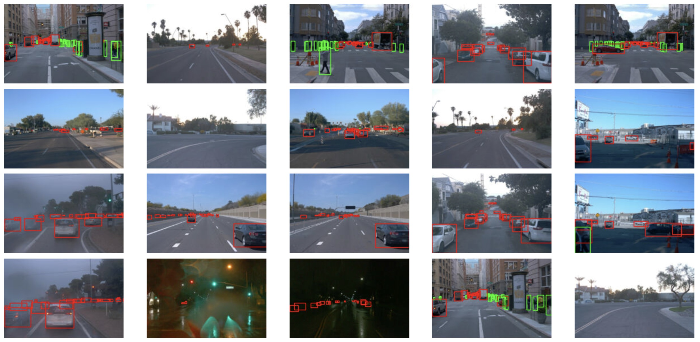
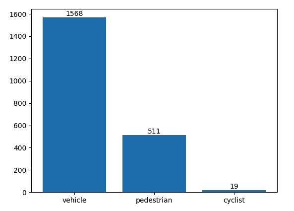
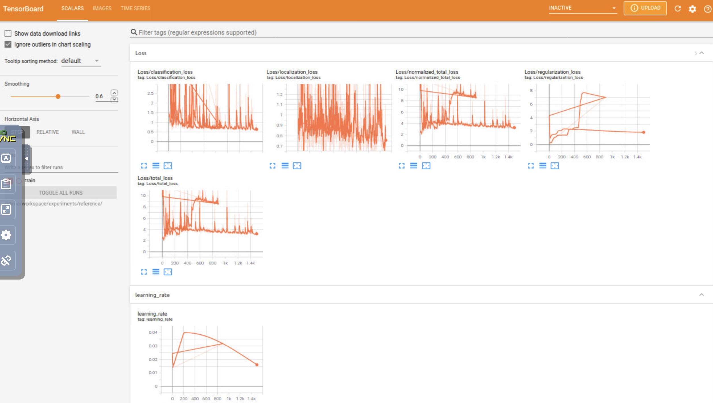
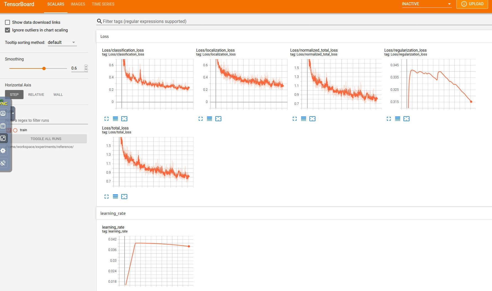

# 1. Project overview: 
**This section should contain a brief description of the project and what we are trying to achieve. Why is object detection such an important component of self-driving car systems?**
This project is the implementation for Project 1, Object Detection in an Urban Environment.  
In this project, I will implement the Object Detection model using ResNet50. I will use Waymo Open dataset to train and classify road objects, such as pedestrians and cyclists. 

# 2. Set up: 
**This section should contain a brief description of the steps to follow to run the code for this repository.**
I use remote workspace as the developing environment.
- Python Version: 3.7.3
- tensorflow Version: 2.4.1
- numpy Version: 1.18.5
- matplotlib Version: 3.4.1

# 3. Dataset
## 1. Dataset Analysis: 
**This section should contain a quantitative and qualitative description of the dataset. It should include images, charts, and other visualizations.**

Waymo open dataset provided road images both during the day and at night. In this dataset, we have 3 categoies of objects, they are vehicles, pedestrians, and cyclists. There are also different weather conditions in the dataset, for example, rainy, foggy and sunny.
The following figure from is from randomly select 100 images. You can find that most of the images don't have cyclists.

## 2. Cross-validation: 
**This section should detail the cross-validation strategy and justify your approach.**
Simple cross-validation:  
- 1st, we randomly divide the sample data into 3 parts.
E.g, 70% training set, 15% validation set and 15% test set.  
- 2nd, we use the training set to train the model and verify the model and parameters on the validation set.  
- 3rd, we use the test set to output result.
- 4th, we disorganize the sample and reselect the training, validation and test sets to continue training the data and testing the model. 
- Finally, we select the loss function to evaluate the optimal model and parameters.　

# 4. Training
## 1. Reference experiment: 
**This section should detail the results of the reference experiment. It should include training metrics, Tensorboard charts, and a detailed explanation of the algorithm's performance.**
The reference model is using ResNet50, the augumentaion is random_crop_image
Training loss of the model is shown as following image:

Performance:  
All the losses are large and very noisy, localization loss does not seem to converge.   
Resnet50 is based on CNN, batch size is the number of training examples in one forward/backward pass. If batch size is too small, it will not converge in time.

## 2. Improve on the reference: 
**This section should highlight the different strategies you adopted to improve your model. It should contain relevant figures and details of your findings.**
Changes:  
batch size: 2 -> 8,
training steps 2500 -> 7500
Training time: around 1 hour  
From the following image, you can find new model is better than the sample model on losses. All the loses tend to converge.  
I also changed the batch to 16 or 32, both are failed due to out of memory. 

